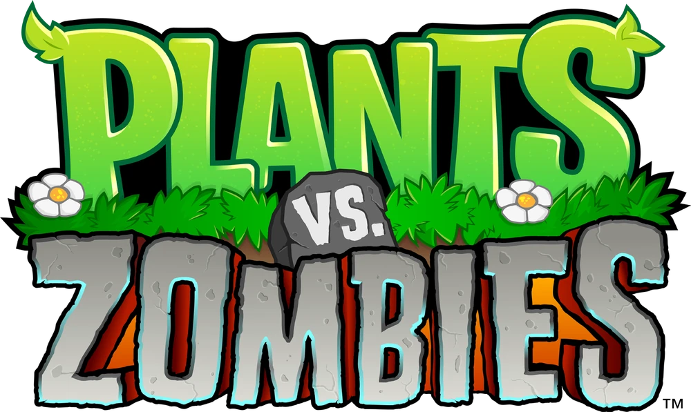

# 3D Artworks

## Giardino di Piante contro Zombie {: style="width:50px; height:auto;" }

> Realizzato nell'estate 2021 per un concept di un aggiornamento per un gioco mobile.

## Rosa

> Realizzata nel 2021 come esercizio personale.

## Ristrutturazione Parco giochi

> Realizzato nel 2022 per un concorso FAI assieme a compagni di scuola.

## Original Character + Animazione

> Realizzato nel 2024 per scopi personali.

## Animatronics di Five Nights at Freddy's (stilizzati) {: style="width:50px; height:auto;" }

> Realizzati nel 2024 per scopi personali.