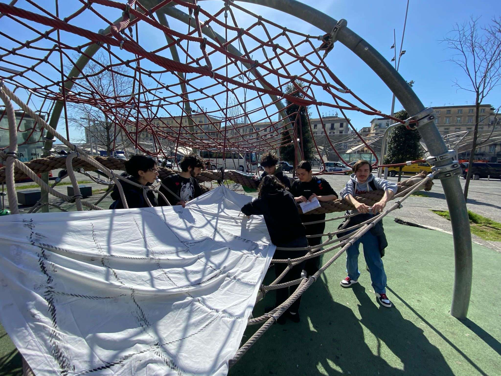

# Blog post #12 

Aggiornamento Gruppo TRAMA DEL TERRITORIO 

il gruppo frottage negli ultimi mesi ha prodotto un gran numero di sperimentazioni. Attualmente il principale focus sono i frottage, strumento di ricerca e documentazione che permette di imprimere su vari materiali la "trama" di alberi, pavimenti e varie texture uniche di Piazza Garibaldi. 
Abbiamo prima sperimentato con rulli, inchiostro e lenzuola, adesso con materiali plastici come il Fimo.
Su alberi, muri, pavimenti e un po' tutto ciò che trovavamo, abbiamo utilizzato grandi lenzuola su cui applicavamo inchiostro con rulli, pastelli a cera e pittura su fogli di carta.
In un tentativo di questi, abbiamo dimenticato di portare con noi dei fogli bianchi; una pattuglia di poliziotti, vedendoci in difficoltà, ci ha dato dei fogli A4, senza chiedere nulla! Abbiamo anche scambiato qualche chiacchiera con persone che frequentano la piazza.
Il Fimo, plastilina soffice che prende la forma della superficie su cui è applicata, ci permette di creare stampi più precisi per imprimere su carta le texture. Siccome il Fimo è costoso e poco sostenibile, abbiamo preparato un nostro impasto a base di amido di mais e altri prodotti di conserva che sembra avere proprietà simili al Fimo, ma è ancora in fase di sperimentazione. 

Soggetti di altre sperimentazioni sono stati la panoramica inversa e la la lente macro, che sono stati temporaneamente accantonati per dare spazio a nuove idee.

