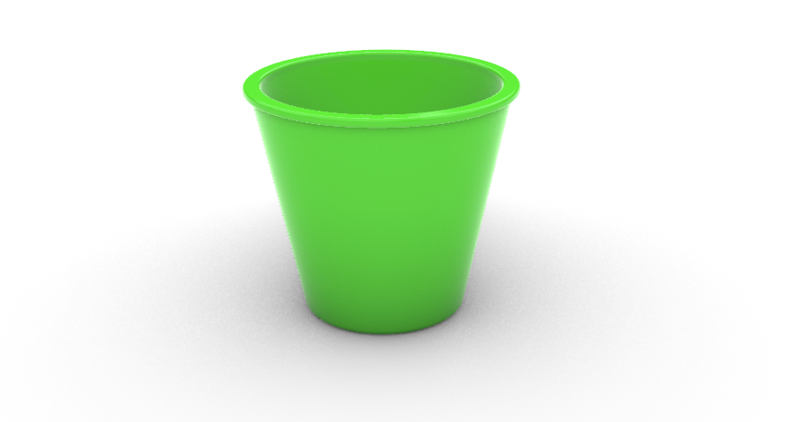
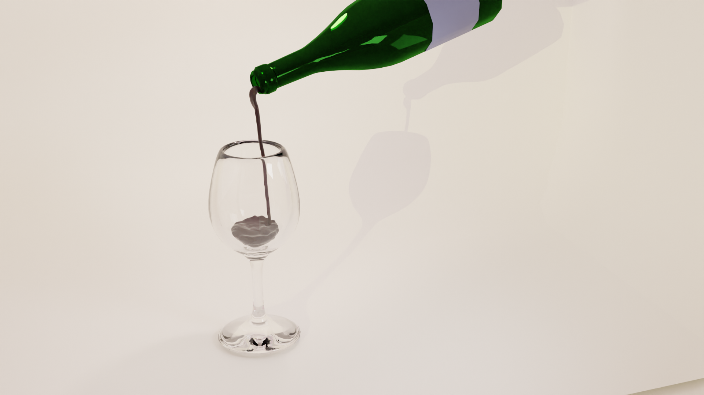

# Blog post #2

Ho svolto un esercizio in Blender e Rhinoceros che consisteva nel realizzare un bicchiere.

## Rhinocesros:

> Non ho avuto grandi problemi nel realizzarlo. Mi chiedevo solo come colorare dterminate parti rispetto ad altre. Inoltre, il rendering non partiva (forse è colpa del mio pc).

## Blender:
# Bicchiere di vino

> Nessun problema qui. Ho litigato un po' con le luci, ma è normale.

# Bottiglia di vino

> Mi sono spinto oltre e ho tentato la fisica dei fluidi. Purtoppo non sono riuscito a renderizzare l'intero video.

